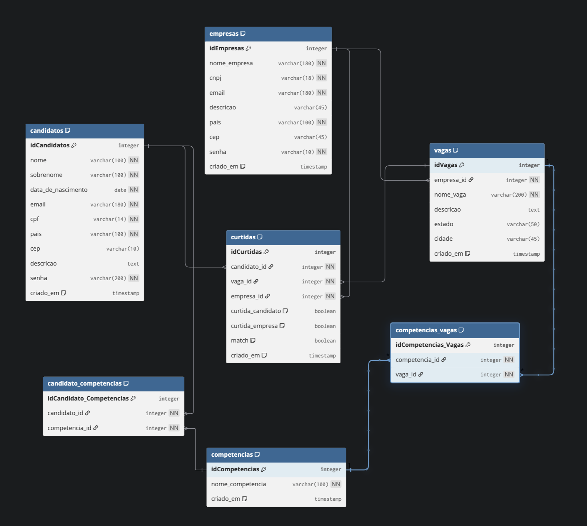

==================================================
```
# LinkeTinder
## 🔄 Mudanças da Refatoração
## Autor
### O que mudou do projeto anterior:
- ✅ **Simplificação da estrutura** - Código mais direto e fácil de entender
- ✅ **Integração JDBC** - Preparação para persistência real no PostgreSQL
- ✅ **Testes com Spock** - Framework moderno e expressivo
- ✅ **Padrão DAO** - Separação da lógica de acesso a dados
- ✅ **Models atualizados** - Campos necessários para banco (id, timestamps, etc)
- ✅ **Data de nascimento** - Candidatos agora informam data de nascimento em vez de idade
- ✅ **Sistema de curtidas simplificado** - Lógica mantida simples para fins didáticos

### Documentação adicional:
- `doc/GUIA_INTEGRACAO_JDBC.txt` - Guia passo a passo da integração JDBC
- `doc/GUIA_SUBSTITUIR_CODIGO_GITHUB.txt` - Como gerenciar branches no Git
- `doc/GUIA_ESTUDO_TDD_SPOCK.txt` - Dicas para estudar TDD com Spock
- `doc/LOGICA_CURTIDAS_EXPLICACAO.txt` - Explicação da lógica de curtidas
- `doc/LOGICA_TESTES_UNITARIOS_EXPLICACAO.txt` - Explicação dos testes

## 📚 Aprendizados Aplicados

Este projeto demonstra:
- ✅ Programação Orientada a Objetos (POO)
- ✅ Interfaces e Herança
- ✅ Integração JDBC com PostgreSQL
- ✅ Padrão DAO (Data Access Object)
- ✅ Testes Unitários com Spock
- ✅ TDD (Test-Driven Development)
- ✅ Estrutura de projeto Gradle
- ✅ Versionamento com Git
> **Este projeto está em desenvolvimento para fins de aprendizado e aplicação dos conhecimentos adquiridos no programa Acelera ZG.**
> 
> **Versão atual:** Refatoração e simplificação com foco em JDBC e testes unitários com Spock.

## 🚀 Tecnologias Utilizadas

### Backend
- **Groovy 4.0.15** - Linguagem de programação
- **Gradle 8.14** - Build tool
- **PostgreSQL 42.7.1** - Banco de dados relacional
- **JDBC** - Integração com banco de dados
- **Spock 2.3** - Framework de testes unitários

### Frontend
- **TypeScript** - Linguagem tipada
- **Vite** - Build tool moderno
- **Tailwind CSS** - Framework de estilos
- **Chart.js** - Visualização de dados

## 📁 Estrutura do Projeto (Backend)

```
src/main/groovy/com/linketinder/
├── Main.groovy                    # Ponto de entrada da aplicação
├── model/                         # Entidades do domínio
│   ├── Candidato.groovy
│   ├── Empresa.groovy
│   ├── Vaga.groovy
│   └── Usuarios.groovy (interface)
├── view/                          # Interface com usuário
│   └── Menu.groovy
├── database/                      # Camada de dados
│   ├── Database.groovy            # Gerenciador central
│   └── DatabaseConnection.groovy  # Conexão JDBC
└── dao/                          # Data Access Objects (em desenvolvimento)
    ├── CandidatoDAO.groovy
    ├── EmpresaDAO.groovy
    └── VagaDAO.groovy

src/test/groovy/com/linketinder/
├── database/
│   └── DatabaseConnectionSpec.groovy  # Testes de conexão
└── view/
    ├── MenuCadastroCandidatoSpec.groovy
    ├── MenuCadastroEmpresaSpec.groovy
    ├── MenuCurtidasCandidatoSpec.groovy
    └── MenuCurtidasEmpresaSpec.groovy
```

## 🎯 Funcionalidades (Backend)

### ✅ Implementadas
- Menu interativo no terminal
- Cadastro de candidatos (com data de nascimento)
- Cadastro de empresas
- Listagem de candidatos e empresas
- Sistema de curtidas:
  - Candidatos podem curtir vagas
  - Empresas podem curtir candidatos
- Testes unitários com Spock
- Conexão JDBC com PostgreSQL

### 🚧 Em Desenvolvimento
- Persistência completa no banco de dados (DAOs)
- CRUD completo de candidatos, empresas e vagas
- Sistema de competências (tabela N:N)
- Matches entre candidatos e empresas

## 💾 Banco de Dados

### Diagrama ER


**Software utilizado:** dbdiagram.io

### Estrutura
- **PostgreSQL** como SGBD
- **7 tabelas principais**:
  - `candidatos` - Dados dos candidatos
  - `empresas` - Dados das empresas
  - `vagas` - Vagas disponíveis
  - `competencias` - Lista de competências
  - `competencias_candidatos` - N:N entre candidatos e competências
  - `competencias_vagas` - N:N entre vagas e competências
  - `curtidas` - Registro de curtidas entre candidatos e empresas

### Scripts SQL
- `LinkeTinder.sql` - Script completo de criação do banco e dados de exemplo

## 🏃 Como Executar

### Pré-requisitos
1. **Java 21+** instalado
2. **Groovy 4.0+** ou usar via Gradle
3. **PostgreSQL** instalado e rodando
4. **Gradle** (ou usar o wrapper `./gradlew`)

### Configuração do Banco de Dados

1. Criar o banco:
```sql
CREATE DATABASE linketinder;
```

2. Executar o script SQL:
```bash
psql -U postgres -d linketinder -f LinkeTinder.sql
```

3. Configurar senha em `DatabaseConnection.groovy`:
```groovy
private static final String PASSWORD = "sua_senha_aqui"
```

### Executar a Aplicação

Via Gradle (recomendado):
```bash
./gradlew run
```

Via Groovy:
```bash
groovy src/main/groovy/com/linketinder/Main.groovy
```

## 🧪 Testes Automatizados

### Executar todos os testes
```bash
./gradlew test
```

### Executar teste específico
```bash
./gradlew test --tests "com.linketinder.database.DatabaseConnectionSpec"
```

### Relatórios de Teste
Após executar os testes, os relatórios estarão em:
- `build/reports/tests/test/index.html` (HTML - abra no navegador)
- `build/test-results/test/` (XML)

### Cobertura de Testes
- ✅ Conexão com banco de dados (5 cenários)
- ✅ Cadastro de candidatos
- ✅ Cadastro de empresas
- ✅ Sistema de curtidas (candidato → vaga)
- ✅ Sistema de curtidas (empresa → candidato)

## 📖 Menu do Sistema

```
LINKETINDER - MENU PRINCIPAL
==================================================
1. Listar Candidatos
2. Listar Empresas
3. Listar Vagas
4. Cadastrar novo Candidato
5. Cadastrar nova Empresa
6. Candidato curtir Vaga
7. Empresa curtir Candidato
8. Sair

**Software utilizado:** dbdiagram.io

## Tecnologias
- PostgreSQL
- 7 tabelas
- Relacionamentos N:N

Projeto desenvolvido por Nathalia Veiga para fins didáticos e de demonstração de boas práticas em Groovy, TDD e arquitetura orientada a serviços no programa Acelera ZG.
