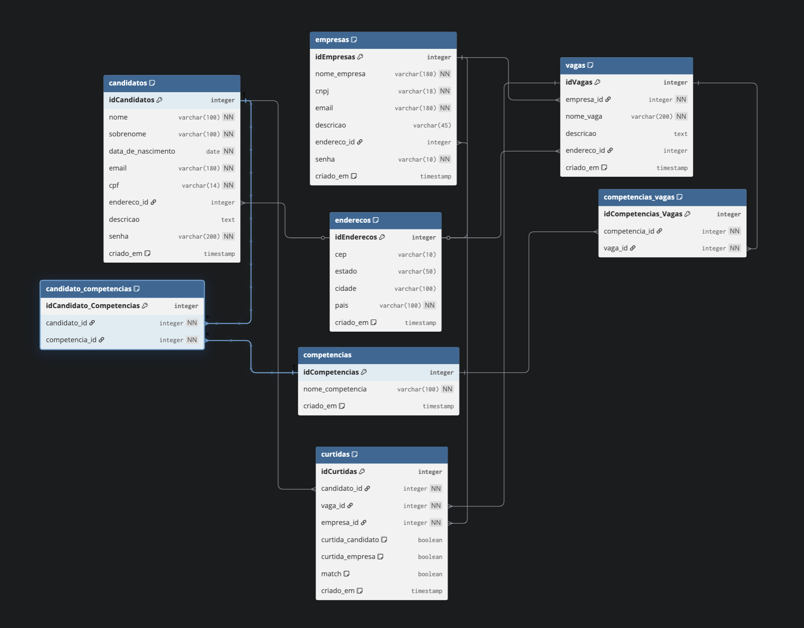

# LinkeTinder

## Autor
Nathalia Veiga 

## Descrição
Sistema de contratação inspirado no LinkedIn e Tinder. Aplicação full-stack com backend em **Groovy + JDBC/PostgreSQL** e frontend em **TypeScript + Vite**.

Permite cadastrar candidatos e empresas, gerenciar vagas e implementar sistema de curtidas/matches.

> **Projeto desenvolvido para o programa Acelera ZG - Desafio K1-T9 (Banco de Dados PostgreSQL)**

## 📁 Estrutura do Projeto

```
LinkeTinder/
├── backend/                      # 🎯 Backend Groovy + PostgreSQL
│   ├── src/
│   │   ├── main/groovy/com/linketinder/
│   │   │   ├── dao/             # Padrão DAO (CandidatoDAO, EmpresaDAO, VagaDAO)
│   │   │   ├── database/        # DatabaseConnection
│   │   │   ├── model/           # Entidades
│   │   │   └── view/            # Menu interativo
│   │   └── test/groovy/         # Testes unitários (38/38 ✅)
│   ├── build.gradle             # Configuração Gradle
│   ├── gradlew                  # Gradle wrapper
│   └── LinkeTinder.sql          # Script do banco
│
└── frontend/                     # 🎨 Frontend TypeScript + Vite
    ├── ts/                      # Código TypeScript
    ├── public/                  # Páginas HTML
    ├── css/                     # Estilos Tailwind
    ├── package.json             # Dependências npm
    └── vite.config.ts           # Configuração Vite
```

---

## 🎯 Backend - Groovy + PostgreSQL

### Tecnologias
- **Groovy 4.0.15** - Linguagem de programação
- **Gradle 8.14** - Build tool
- **PostgreSQL 14+** - Banco de dados relacional
- **JDBC puro** - Sem frameworks ORM
- **Spock 2.3** - Framework de testes unitários

### Funcionalidades Backend
- ✅ **CRUD completo:** Candidatos, Empresas e Vagas
- ✅ **Persistência:** PostgreSQL via JDBC puro
- ✅ **Relacionamentos:** 
  - N:N entre Candidato ↔ Competências
  - N:N entre Vaga ↔ Competências  
  - 1:N entre Empresa → Vagas
- ✅ **Testes:** 38 testes unitários com Spock (100% cobertura DAOs)

### Banco de Dados

**Diagrama ER:**  


**Estrutura:**  
8 tabelas principais com relacionamentos completos:
- `enderecos` - Centralizada para normalização
- `candidatos`, `empresas`, `vagas` - Entidades principais
- `competencias` - Habilidades técnicas
- `candidato_competencias`, `competencias_vagas` - Relacionamentos N:N
- `curtidas` - Sistema de matches

**Relacionamentos:**
- **N:N** - Candidato ↔ Competências (via `candidato_competencias`)
- **N:N** - Vaga ↔ Competências (via `competencias_vagas`)
- **1:N** - Empresa → Vagas (FK `empresa_id`)
- **1:N** - Endereço → Candidatos/Empresas/Vagas (FK `endereco_id`)
- **N:N** - Sistema de Curtidas bidirecional (candidatos ↔ vagas)

**Índices para performance:**
- Emails, CPF, CNPJ, CEP
- Foreign Keys e campos de busca frequente

### Como Executar o Backend

#### 1. Pré-requisitos
- Java 17+
- PostgreSQL 14+ rodando
- Gradle 8.14+ (ou usar `./gradlew`)

#### 2. Configurar Banco de Dados
```bash
# Criar banco
psql -U postgres -c "CREATE DATABASE linketinder;"

# Executar script (agora está em backend/)
psql -U postgres -d linketinder -f backend/LinkeTinder.sql
```

#### 3. Configurar Senha
Edite `backend/src/main/groovy/com/linketinder/database/DatabaseConnection.groovy`:
```groovy
private static final String PASSWORD = "sua_senha_aqui"
```

#### 4. Executar
```bash
cd backend
./gradlew run        # Rodar aplicação
./gradlew test       # Rodar testes (38/38 ✅)
./gradlew build      # Build do projeto
```

**Relatório de testes:** `backend/build/reports/tests/test/index.html`

### Conceitos Aplicados (Backend)
- **POO:** Classes, interfaces, herança, encapsulamento
- **JDBC:** PreparedStatement, gerenciamento de conexões/recursos
- **Padrão DAO:** Separação de responsabilidades, camada de persistência
- **BaseDAO:** Classe base reutilizável (DRY - Don't Repeat Yourself)
- **Relacionamentos:** 1:N e N:N com tabelas intermediárias
- **TDD:** Testes unitários com Spock Framework (38/38 ✅)
- **SQL:** DDL, DML, JOINs, Foreign Keys, CASCADE, índices

### Melhorias Clean Code Aplicadas
**Score:** 48% → 72% (+24% de melhoria)

✅ **Refatorações concluídas:**
- Anotações Groovy (`@EqualsAndHashCode`, `@ToString`) - eliminou ~200 linhas
- BaseDAO genérico - reutilização de código em 3 DAOs
- DRY no CompetenciaDAO - redução de 57% de código duplicado
- Nomes descritivos em português (conexao, comando, resultado)
- 5 bugs críticos corrigidos (email null, descricao null, sintaxe)
- Separação de responsabilidades (modelos vs banco)

📊 **Resultados:**
- 38/38 testes passando (100%)
- ~280 linhas de código eliminadas
- Código mais legível e manutenível

---

## 🎨 Frontend - TypeScript + Vite

### Tecnologias
- **TypeScript** - Linguagem tipada
- **Vite** - Build tool moderno
- **Tailwind CSS** - Framework CSS utility-first
- **Chart.js** - Visualização de dados

### Funcionalidades Frontend
- ✅ **Páginas:** Candidatos, Empresas, Vagas
- ✅ **Visualização:** Cards com informações detalhadas
- ✅ **Estatísticas:** Gráficos e métricas
- ✅ **Design:** Responsivo com Tailwind CSS

### Como Executar o Frontend

```bash
cd frontend
npm install
npm run dev          # http://localhost:5173
npm run build        # Build para produção
```

### Conceitos Aplicados (Frontend)
- **TypeScript:** Tipagem estática, interfaces
- **DOM:** Manipulação do DOM
- **CSS:** Estilização responsiva com Tailwind
- **Vite:** Build otimizado e HMR

---

**Projeto desenvolvido por Nathalia Veiga | Acelera ZG 2025**
